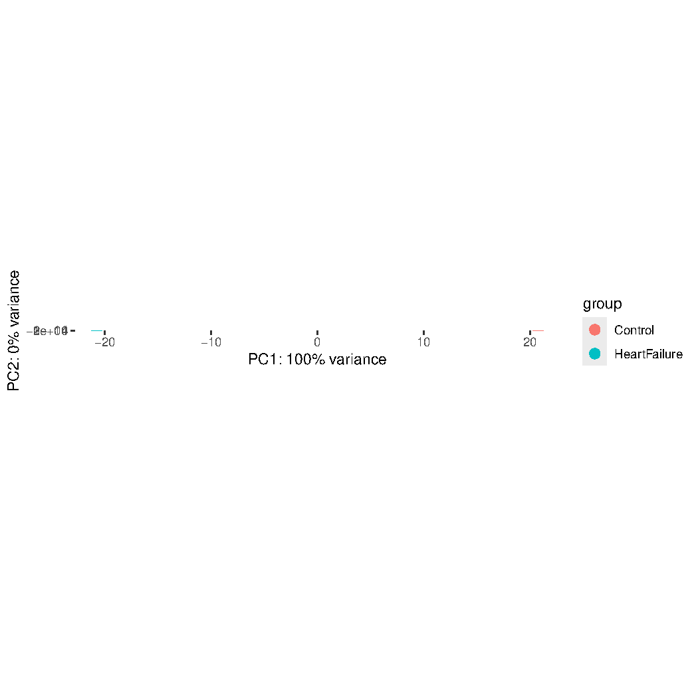
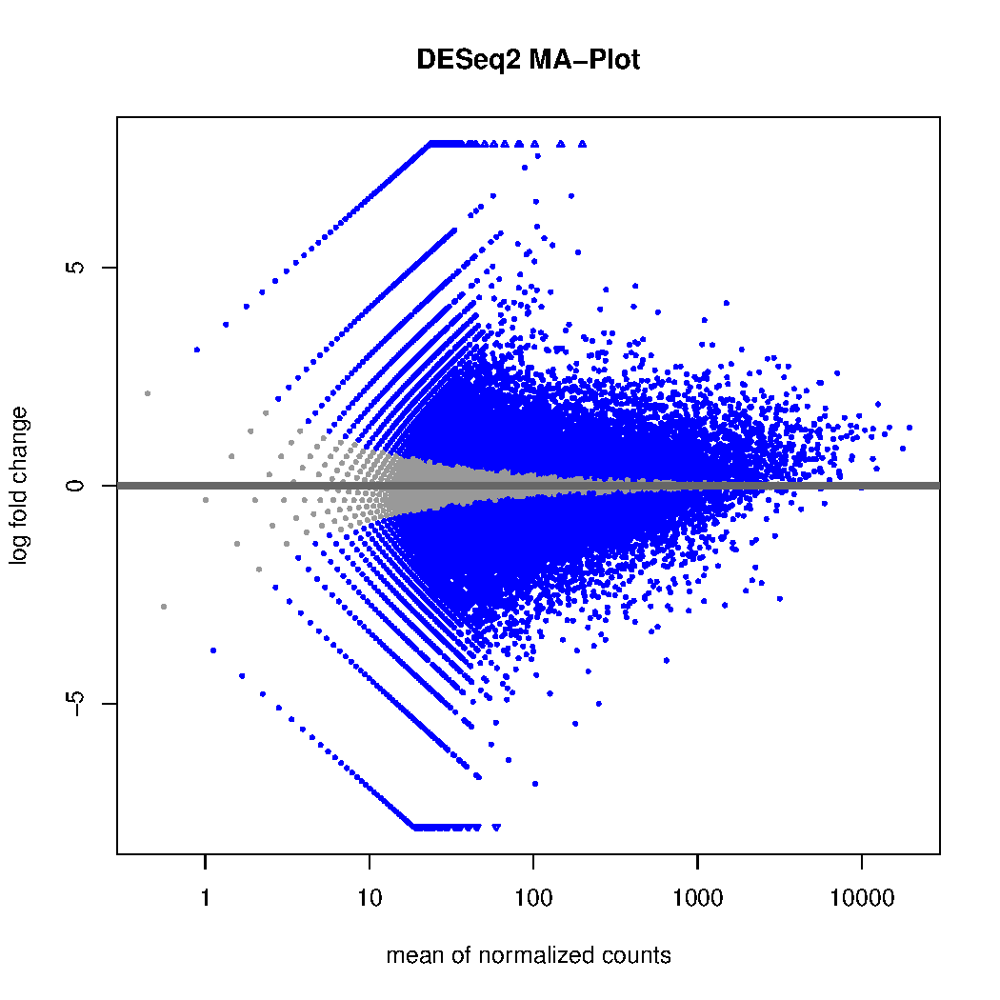

# HeartFailure_RNASeq

RNA-seq differential expression analysis comparing heart failure vs control samples using DESeq2.

Started this to get proper hands-on experience with a standard bulk RNA-seq pipeline. Chose heart failure specifically because I've done echo assessments on DCM and HCM patients as a cardiac physiologist — wanted to look at the transcriptomic side of what's happening in those hearts.

## Workflow

1. Download FASTQ from SRA + QC with `fastp`
2. Align to hg38 with `STAR`, sort with `samtools`
3. Count reads with `featureCounts`
4. Differential expression with `DESeq2`

## Setup

Needs conda with STAR, samtools, R, and featureCounts. ~20 GB free disk space.

```bash
conda activate bio_env

bash scripts/download_qc.sh
bash scripts/align_only.sh
bash scripts/align_count.sh
Rscript scripts/deseq2_analysis.R
```

## Outputs

PCA plot and MA plot are in `figures/`.





Note: this uses duplicated BAM files to simulate replicates — only had one sample available for this demo. Real analysis would need at least 3 biological replicates per condition.

Large FASTQ/BAM files are not versioned.

---

Author: Muna Berhe
